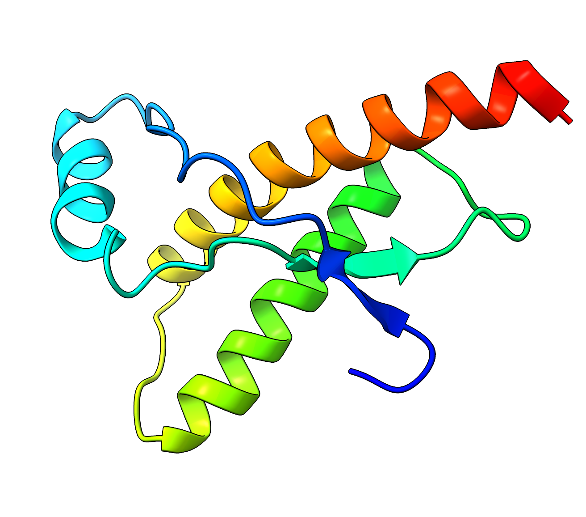
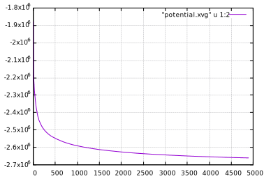
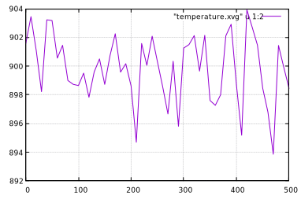
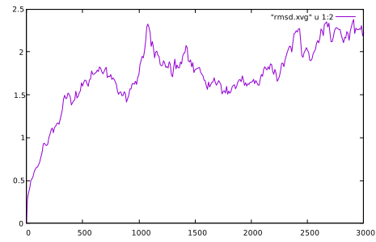
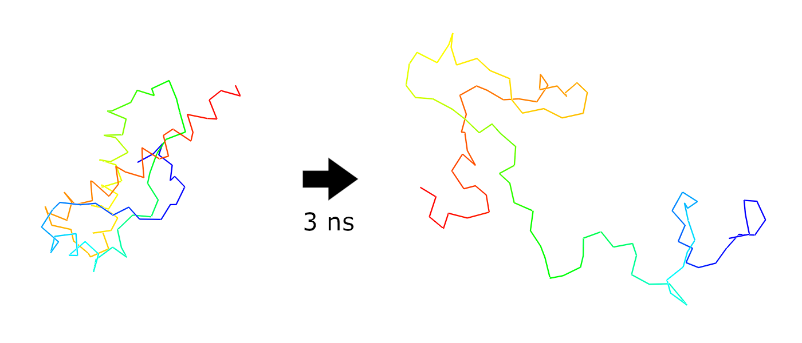
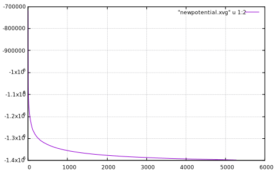
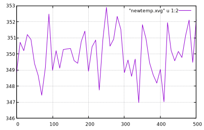
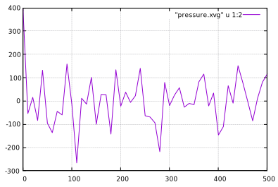
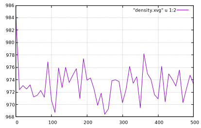

PrP mutants folding pathways simulation
=======================================

Perform a folding pathways simulation of human prion protein (PrP) mutants using `Gromacs` (version 2020.4) in the following steps:
- thermal unfolding of the native state to prepare multiple unfolded states
- production of multiple folding trajectories using ratchet and pawl (rMD) MD, starting from the generated unfolded states
- scoring the obtained trajectories


Unfolding the protein
---------------------

Consider the C-terminal domain (?) of the human prion protein 1QLX (<https://www.rcsb.org/structure/1QLX>)
with 104 residues



Start with the experimentally identified native states of the following four mutants:
`M129N178.pdb`, `M129WT.pdb`, `V129N178.pdb` and `V129WT.pdb`.

The following steps are applied to each of the mutatants.
Refer to [unfold.sh](unfold.sh) for the complete script with the commands summarized (see "README" notes inside).

### Prepare the environment (technical notes for working at the cluster):

* copy the force field files `charmm36-mar2019.ff` into working directory
* load the `Gromacs` module: `module load gromacs/2020.4`
* use `Slurm` workload manager to submit the jobs

### Generate topology for the protein:

```console
$ gmx pdb2gmx -f M129N178.pdb -o start.gro -ignh
```

* The force field defines the inter-atomic potential energy field
	- use currently most updated version `CHARMM36` (Charmm36-mar2019)
* Use `TIP3P` water model for the solvent

### Define the simulation box geometry:

Use the dodecahedral box with 4 nm distance to the boundary:

```console
$ gmx editconf -f start.gro -o box.gro -c -d 4.0 -bt dodecahedron
```

### Solvate the system:

```console
$ gmx solvate -cp box.gro -cs spc216.gro -o solvated.gro -p topol.top
```

### Add ions:

```console
$ gmx grompp -f em.mdp -c solvated.gro -p topol.top -o ions.tpr -maxwarn 1
$ gmx genion -s ions.tpr -o solv_ions.gro -p topol.top -pname NA -nname CL -neutral -conc 0.15
```
* Use energy minimisation parameters file `em.mdp`
* Ignore `Gromacs` warnings; select the solvent group `SOL`

### Energy minimization:

```console
$ gmx grompp -f em.mdp -c solv_ions.gro -p topol.top -o em.tpr
$ gmx mdrun -v -deffnm em
```
* Use `em.mdp` with the steepest descend integrator
* Remember to use `Slurm` for each `mdrun`
* Do not use `mdrun ... -update gpu -bonded gpu` in this case

Check the result of energy minimization:

```console
$ gmx energy -f em.edr -o potential.xvg -xvg none
```



### NVT Equilibration:
Start by equilibrating without a barostat, otherwise computation will blow up.
Use only NVT V-rescale thermostat for unfolding at *high* temperature (900 K).

```console
$ gmx grompp -f nvt.mdp -c em.gro -r em.gro -p topol.top -o nvt.tpr
$ gmx mdrun -v -deffnm nvt -update gpu -bonded gpu
```
* use `nvt.mdp` input parameters file:
	- 500 ps simulation with 2 fs step
	- ref_t = 900
	- gen_temp 900
	- tcoupl = V-rescale
* will take around 10 min to complete on the GPU

Check the result of the NVT equilibration:

```console
$ gmx energy -f nvt.edr -o temperature.xvg -xvg none
```



### Unfolding MD run:
For PrP run the simulation from 3 to 5 ns for denaturation.

```console
$ gmx grompp -f md.mdp -c nvt.gro -p topol.top -t nvt.cpt -o md.tpr
$ gmx mdrun -v -deffnm md -update gpu -bonded gpu
```
* use `md.mdp` input parameters file:
	- 3 ns simulation with 2 fs step
	- ref_t = 900
	- tcoupl = V-rescale
* will take about an hour to complete on the GPU

Compute RMSD and choose the farthest configurations for the rMD run.
Plot the RMSD (in [nm]):
```console
$ gmx rms -s md.tpr -f md.xtc -o rmsd.xvg
```



Prepare trajectory for visualization:

```console
$ gmx trjconv -f md.xtc -s md.tpr -pbc mol -o unfolded.pdb
```




Equilibration
-------------

Eventually generate about 10 different unfolding states for the rMD run.
Equilibration is better to run at aprroximately average melting temperature of the protein (350K ?),
because it has higher chance to reach folded state.

Technical note: reuse old topology files.

### Redefine the box:

Use the dodecahedral box with 1 nm distance to the boundary:

```console
$ gmx editconf -f unfolded_1.pdb -o newbox.gro -c -d 1.4 -bt dodecahedron
```

### Solvate the new system:

```console
$ cp '#topol.top.1#' newtopol.top
$ gmx solvate -cp newbox.gro -cs spc216.gro -o newsolvated.gro -p newtopol.top
```

### Add ions:

```console
$ gmx grompp -f em.mdp -c newsolvated.gro -p newtopol.top -o newions.tpr -maxwarn 1
$ gmx genion -s newions.tpr -o newsolv_ions.gro -p newtopol.top -pname NA -nname CL -neutral -conc 0.15
```
* Use energy minimisation parameters file `em.mdp`
* Ignore `Gromacs` warnings; select the solvent group `SOL`

### Energy minimization in the new box:

```console
$ gmx grompp -f em.mdp -c newsolv_ions.gro -p newtopol.top -o newem.tpr
$ gmx mdrun -v -deffnm newem
```

Check the result of energy minimization:

```console
$ gmx energy -f newem.edr -o newpotential.xvg -xvg none
```



### NVT Equilibration:

```console
$ gmx grompp -f nvt2.mdp -c newem.gro -r newem.gro -p newtopol.top -o newnvt.tpr
$ gmx mdrun -v -deffnm newnvt -update gpu -bonded gpu
```
* use `nvt2.mdp` input parameters file:
	- 500 ps simulation with 2 fs step
	- ref_t = 350
	- gen_temp 350
	- tcoupl = V-rescale
* will take around 10 min to complete on the GPU

Check the result of the NVT equilibration:

```console
$ gmx energy -f newnvt.edr -o newtemp.xvg -xvg none
```



### NPT Equilibration

Add barostat for folding:

```console
$ gmx grompp -f npt.mdp -c newnvt.gro -r newnvt.gro -t newnvt.cpt -p newtopol.top -o newnpt.tpr
$ gmx mdrun -v -deffnm newnpt -update gpu -bonded gpu
```

* use `npt.mdp` input parameters file:
	- 500 ps simulation with 2 fs step
	- ref_t = 350
	- gen_temp 350
	- tcoupl = V-rescale
* will take around 10 min to complete on the GPU

Check NPT:

```console
$ gmx energy -f newnpt.edr -o pressure.xvg -xvg none
```



Check density:

```console
$ gmx energy -f newnpt.edr -o density.xvg -xvg none
```




rMD run
-------

### Prepare the input files

Remove all the solvent/ions atoms (SOL, NA and CL) from the `em.gro` file of the energy-minimized native state
and save it as `em_protein.gro`. Then run

```console
$ gmx editconf -f em_protein.gro -o em_protein.pdb
```

Assuming `Run` directory is inside the current working directory:

```console
$ cd Run
$ cp ../em_protein.pdb native.pdb
$ cp native.cmp ratchet/
$ cp ../newnpt.gro ratchet/conditions/c1/npt.gro
$ cp ../newtopol.top ratchet/conditions/c1/topol.top
```

### Run the Python script

Slurm is used intrinsically by the script, so explicit invocation is not needed.

```console
$ python start_ratchet.py
```
